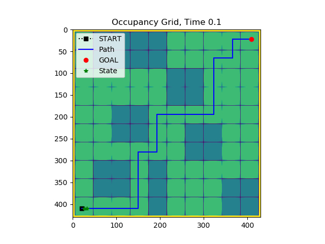
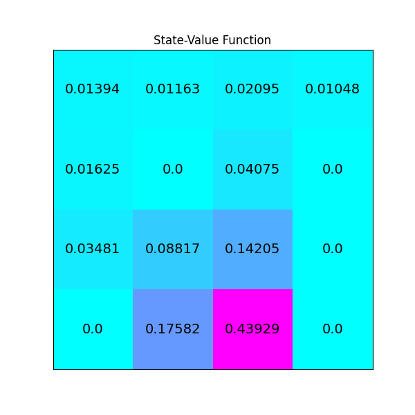

# cubeAI

CubeAI is a C++ library containing implementations of various reinforcement learning, filtering and planning algorithms.
The library documentation (under development) can be found here <a href="https://pockerman-py-cubeai.readthedocs.io/en/latest/">PyCubeAI</a>
The Python flavor of the library can be found at <a href="https://github.com/pockerman/py_cube_ai">PyCubeAI</a>.
 

## Examples


- <a href="https://pockerman-py-cubeai.readthedocs.io/en/latest/ExamplesCpp/rl/rl_example_0.html">Example 0: DummyAgent on  ```MountainCar-v0```</a>
- <a href="examples/example_1/example_1.cpp">Example 1: Toy Markov chain</a>
- <a href="examples/example_2/example_2.cpp">Example 2: Multi-armed bandit with epsilon-greedy policy</a>
- <a href="examples/example_3/example_3.cpp">Example 3: Multi-armed bandit with soft-max policy</a>
- <a href="examples/example_4/example_4.cpp">Example 4: Advertisement placement</a>
- <a href="https://pockerman-py-cubeai.readthedocs.io/en/latest/ExamplesCpp/rl/rl_example_6.html">Example 6: Iterative policy evaluation on ```FrozenLake-v0```</a>
- <a href="examples/example_7/example_7.cpp">Example 7: Policy iteration on ```FrozenLake-v0```</a>
- <a href="examples/example_8/example_8.cpp">Example 8: Value iteration on ```FrozenLake-v0```</a>
- <a href="examples/example_9/example_9.cpp">Example 9: SARSA on ```CliffWalking-v0```</a>
- <a href="examples/example_10/example_10.cpp">Example 10: Q-learning on ```CliffWalking-v0```</a>
- <a href="examples/example_14/example_14.cpp">Example 14: Expected SARSA on ```CliffWalking-v0```</a>
- <a href="examples/example_15/example_15.cpp">Example 15: Approximate Monte Carlo on ```MountainCar-v0```</a>
- <a href="examples/example_16/example_16.cpp">Example 16: Monte Carlo tree search on ```Taxi-v3```</a>
- <a href="examples/example_17/example_17.cpp">Example 17: A* search on a road network  from Open Street Map data</a> 
- <a href="examples/example_18/example_18.cpp">Example 18: Double Q-learning on  ```CartPole-v0``` </a> 
- <a href="#">Example 19: Path planning with rapidly-exploring random trees (TODO)</a> 
- <a href="#">Example 20: Path planning with dynamic windows (TODO) </a>   

### PyTorch based examples

- <a href="examples/example_11/example_11.cpp">Example 11: Simple linear regression</a>
- <a href="examples/example_12/example_12.cpp">Example 12: DQN on ```CartPole-v0```</a>
- <a href="examples/example_13/example_13.cpp">Example 13: Reinforce algorithm on ```CartPole-v0```</a>
- <a href="examples/example_21/example_21.cpp">Example 21: Simple logistic regression</a>


## Dependencies

- CMake
- Python >= 3.8
- PyTorch C++ bindings
- <a href="https://bitbucket.org/blaze-lib/blaze/src/master/">Blaze</a> (version >= 3.8)
- Blas library, e.g. OpenBLAS (required by Blaze)
- <a href="#">gymfcpp</a>

### Documentation dependencies

There are extra dependencies if you want to generate the documentation. Namely,

- Doxygen
- Sphinx
- sphinx_rtd_theme
- breathe
- m2r2

## Installation

- Install the dependencies
- ```mkdir build && cd build```
- ```cmake ..```
- ```make install```

If you are using ```gymfcpp``` you need to export the path to the Python version you are using. For ecample:

```
export CPLUS_INCLUDE_PATH="$CPLUS_INCLUDE_PATH:/usr/include/python3.8/"
```

Depending on the values of the ```CMAKE_BUILD_TYPE```, the produced shared library will be installed in ```CMAKE_INSTALL_PREFIX/dbg/``` or ```CMAKE_INSTALL_PREFIX/opt/``` directories.

## Issues

### ```pyconfig.h``` not found

- Export the path to your Python library directory as shown above

### Problems with Blaze includes

- ```cubeai``` is using Blaze-3.8. As of this version the ```FIND_PACKAGE( blaze )``` command does not populate ```BLAZE_INCLUDE_DIRS``` 
therefore you manually have to set the variable appropriately for your system.


## References

- <a href="https://pytorch.org/cppdocs/">PyTorch C++ API</a>


## Images





